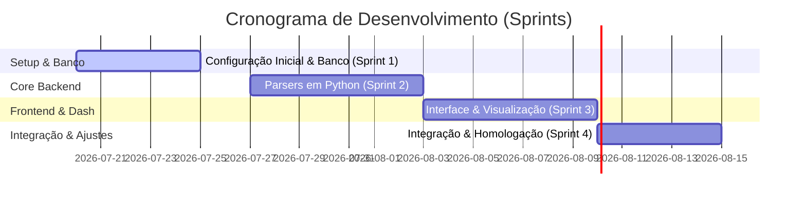

# Plano de Implementação: Controle Financeiro Híbrido (Next.js + Python + Supabase)

Este plano descreve as etapas de desenvolvimento para o aplicativo de controle financeiro a ser hospedado na Vercel, com banco de dados gratuito no Supabase e parsing de arquivos (Excel/PDF) via Python.

---

## Sprints de Desenvolvimento

### Sprint 1: Setup do Ambiente e Modelagem do Banco (Duração: 5 dias)
* **Objetivo:** Preparar a infraestrutura básica de banco de dados e a fundação do Next.js.
* **Entregas:**
  1. Criação do projeto Next.js na raiz `d:\Controle_Financeiro\`.
  2. Definição do schema do banco de dados PostgreSQL (tabelas de transações, categorias, contas e cartões de crédito).
  3. Configuração do projeto no Supabase (Rodar Scripts SQL de migração).
  4. Configuração das variáveis de ambiente e cliente de conexão no Next.js.

### Sprint 2: Core Backend - Parsers em Python (Duração: 7 dias)
* **Objetivo:** Desenvolver a lógica de processamento de arquivos para automatizar a leitura de extratos/faturas.
* **Entregas:**
  1. Configuração do ambiente Python Serverless na Vercel (definição do `requirements.txt`).
  2. Implementação do parser de planilhas (`/api/process_excel.py`) usando Pandas para mapear e normalizar transações de arquivos Excel/CSV.
  3. Implementação do parser de PDFs (`/api/process_pdf.py`) usando expressões regulares para ler extratos de texto nativo dos principais bancos (configurável).
  4. Rota para salvar essas transações processadas diretamente no Supabase em lote (bulk insert).

### Sprint 3: Frontend Premium & Dashboards (Duração: 7 dias)
* **Objetivo:** Criar a interface visual focada em experiência de usuário e visualização de dados.
* **Entregas:**
  1. Criação da identidade visual e sistema de design usando CSS Vanilla (Dark Mode por padrão, fontes modernas e transições suaves).
  2. Tela de Upload: Área para arrastar e soltar arquivos (PDF/Excel) com feedback visual de processamento.
  3. Tela de Transações: Listagem das movimentações salvas com busca, filtros por categoria/data e opção de inserção manual rápida.
  4. Dashboard de Insights: Gráficos de entradas vs. saídas, distribuição de gastos por categoria e balanço acumulado.

### Sprint 4: Integração, Regras de Negócio e Deploy (Duração: 5 dias)
* **Objetivo:** Finalizar as amarrações do sistema e publicar na Vercel.
* **Entregas:**
  1. Mecanismo de classificação inteligente básica (ex: se o texto contiver "Uber", marcar automaticamente a categoria como "Transporte").
  2. Testes de ponta a ponta com dados reais simulados.
  3. Deploy do projeto na Vercel e configuração das variáveis de ambiente de produção.

---

## Próximos Passos Imediatos
1. Criar a estrutura básica do projeto Next.js na pasta do projeto `d:\Controle_Financeiro\`.
2. Salvar os arquivos de documentação (`gemini.md` e a arquitetura) diretamente no repositório local.
3. Gerar o script SQL de migração do banco para você rodar no Supabase.
